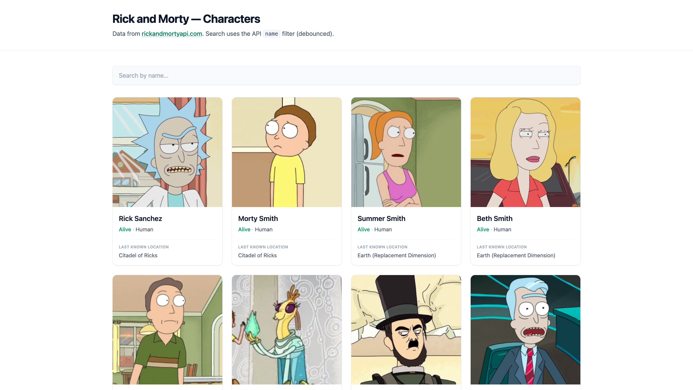

# rick-morty-api

A React demo that lists characters from the [Rick and Morty API](https://rickandmortyapi.com/). This repo showcases how **Cursor skills** and **rules** apply to the project:

- **Skill** — `.cursor/skills/rick-morty-react-feature/SKILL.md`: feature workflow (fetching, responsive grid, search, pagination, UX, and stack constraints).
- **Rules** — `.cursor/rules/react-project.mdc`: baseline standards (components, Tailwind, error handling, performance).

